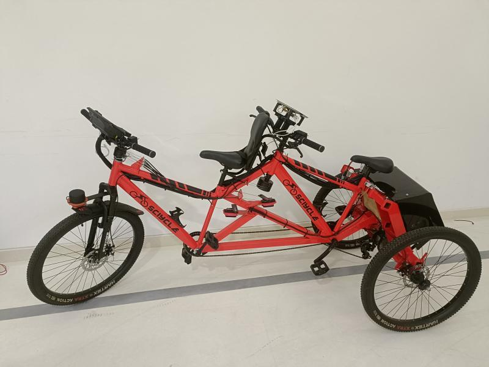

# 🚲 Autonomous Tricycle

An intelligent **Electric Autonomous Tricycle** designed to provide safe, independent mobility for differently-abled individuals, autistics and the general public. Built with accessibility, comfort, and autonomy in mind.

---

## 🌍 Social Impact

Focused on inclusive mobility, this project supports:
- **SDG 3:** Good Health & Well-being  
- **SDG 10:** Reduced Inequalities  
- **SDG 11:** Sustainable Cities & Communities  

> ♿ A people-first mobility solution enhancing independence and dignity.

---

## 🏆 Achievements

- 🥇 **Winners – AICTE Bharat Cycle Design Challenge**  
  ₹1,00,000 ($1,160) awarded  
  Developed an EV tricycle to empower differently-abled individuals  
  *(Nov 2023)*

- 🥇 **Winners – Nan Mudhalvan Niral Thiruvizha Hackathon, Govt. of Tamil Nadu**  
  ₹1,00,000 ($1,160) awarded  
  Designed an autonomous commute trike for the autistic, differently-abled & public  
  *(Sep 2024)*

---

## ⚙️ Features

- 🧠 Autonomous navigation with safety protocols  
- ⚡ Electric drive system for low-carbon commuting  
- ♿ Ergonomic design for inclusive use  
- 🔋 Battery-powered with extended runtime  

---

## 📁 Repo Contents

- `Design_Files.zip` – CAD and mechanical drawings  
- `Electronics_Schematic.pdf` – Wiring layout  
- `Demo_Video.zip` – Test ride and autonomy demo  
- `Report.zip` – Technical & impact documentation  
- `Presentation.zip` – Final pitch deck  

---

## 🛠️ Tools Used

- **Fusion 360 / SolidWorks** – Design & simulation  
- **Raspberry Pi** – Embedded control  
- **Python / C++** – Codebase for autonomy  
- **Motor Drivers + Sensors** – Motion & detection  
- **Git LFS** – For large file versioning  

---
